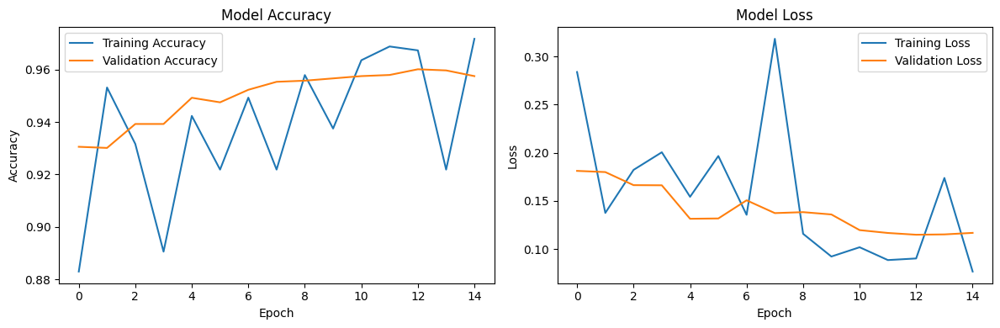

# Gender Classification

A deep learning model that classifies images of faces as male or female using Convolutional Neural Networks (CNN) built with TensorFlow and Keras.

## Project Overview

This project implements a gender classification system that can identify whether a given facial image is of a male or female. The model uses a CNN architecture trained on the [Kaggle Gender Classification Dataset](https://www.kaggle.com/datasets/cashutosh/gender-classification-dataset).

## Model Architecture

The model consists of:

- Convolutional layers for feature extraction
- MaxPooling layers for spatial dimensionality reduction
- Dropout for regularization
- Dense layers for classification
- Binary output with sigmoid activation

```
Model: Sequential
_________________________________________________________________
Conv2D(32, (3, 3), activation='relu', input_shape=(100, 100, 3))
MaxPooling2D((2, 2))
Conv2D(64, (3, 3), activation='relu')
MaxPooling2D((2, 2))
Flatten()
Dense(128, activation='relu')
Dropout(0.5)
Dense(1, activation='sigmoid')
```

## Training Results

The model was trained for 15 epochs with the following parameters:

- Learning rate: 0.001
- Optimizer: Adam
- Loss function: Binary Cross-Entropy
- Input image size: 100x100 pixels

### Training History



## Usage

### Installation Requirements

```
tensorflow
numpy
matplotlib
kagglehub
```

### Training the Model

```
python train.py
```

This script will:

1. Download the dataset from Kaggle
2. Preprocess the images
3. Train the CNN model
4. Save the model as 'gender_classification_model.h5'
5. Generate training history visualization

### Testing the Model

```
python test.py
```

This script will:

1. Load the pre-trained model
2. Process a test image ('test.jpg')
3. Make a prediction (Male/Female)
4. Display the image with the prediction

## Example Prediction

The model can predict gender with a confidence score between 0 and 1:

- Values closer to 0 indicate female
- Values closer to 1 indicate male

## Acknowledgements

- Dataset provided by Ashutosh Chauhan on Kaggle
